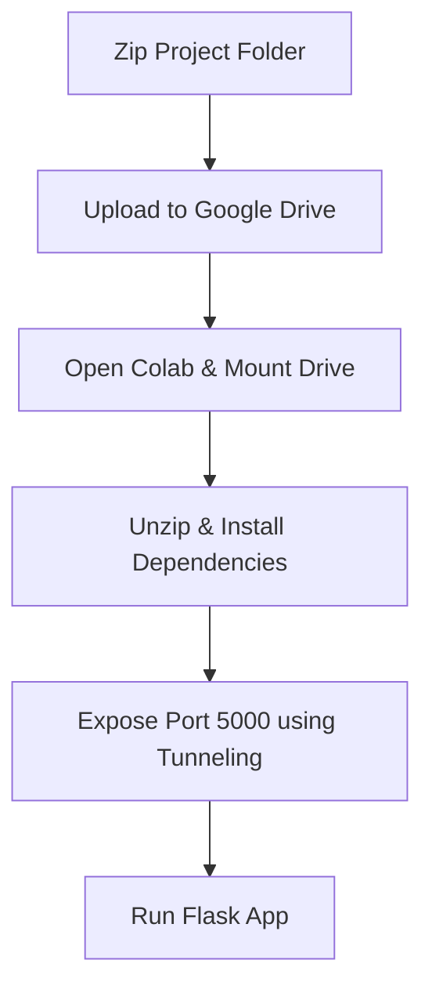

# Google Colab Setup Guide: Running MomentumScan

Google Colab provides a free Linux container with a fast internet connection and pre-installed machine learning libraries. Since MomentumScan runs **Kronos-small** model predictions on CPU, running on Colab is highly efficient and keeps your local CPU free.

Here is the step-by-step guide to uploading, setting up, and launching the project on Google Colab.

---

## 🗺️ Execution Workflow



---

## 🎬 Step-by-Step Implementation

### Step 1: Prepare & Upload Your Project
Zip your local `stock-screener` project folder.
1. Create a zip of your folder (e.g., `stock-screener.zip`).
2. Upload this zip file to your Google Drive in a folder called `Colab Notebooks` (or the root directory).

### Step 2: Open a New Colab Notebook
1. Go to [Google Colab](https://colab.research.google.com/).
2. Create a **New Notebook**.
3. Choose the standard **CPU Runtime** (no GPU is required for Kronos CPU inference).

### Step 3: Mount Google Drive
In your first Colab code cell, run the following code to mount Google Drive:

```python
from google.colab import drive
drive.mount('/content/drive')
```
*Click the authentication link, select your Google account, and copy the authorization code into Colab.*

### Step 4: Extract the Project Zip
Find where your zip file was uploaded and unzip it into the Colab workspace:

```bash
# Navigate to the workspace
%cd /content/

# Unzip the project (update path if you uploaded it to a subdirectory)
!unzip -q "/content/drive/MyDrive/stock-screener.zip" -d "/content/stock-screener"

# Navigate into the project directory
%cd /content/stock-screener/
```

### Step 5: Install Python Dependencies
Install the required Python packages in a Colab code cell. (We install a CPU-only light version of PyTorch for faster compilation and execution):

```bash
# Install PyTorch CPU-only package
!pip install -q torch --index-url https://download.pytorch.org/whl/cpu

# Install the rest of the dependencies
!pip install -q flask requests pandas openpyxl transformers huggingface_hub einops sentencepiece prophet statsmodels
```

---

## 🌐 Exposing the Flask App (3 Tunneling Options)

Choose **one** of the options below to generate a public URL that connects to the Flask server running inside Colab.

### Option A: Colab's Built-in Proxy (Recommended & Simplest)
Colab has a built-in function to proxy local ports. It doesn't require any token signup. 

Run this in a cell:
```python
from google.colab.output import eval_js
print("Click the link below to open your MomentumScan Cockpit:")
print(eval_js("google.colab.kernel.proxyPort(5000)"))
```
*Note: This link only works while logged into the Google account hosting the Colab.*

---

### Option B: Localtunnel (Free Public URL)
If you want a public URL that you can open from other devices or share, run the following commands:

1. Install Localtunnel globally in Node:
   ```bash
   !npm install -g localtunnel
   ```
2. Get your public IP address (Localtunnel asks for this as a password):
   ```bash
   !curl ipv4.icanhazip.com
   ```
3. Expose port 5000:
   ```bash
   !lt --port 5000
   ```
   *Copy the IP address returned from step 2, click the Localtunnel URL, and paste the IP to gain access.*

---

### Option C: Ngrok (Fastest, Requires Free Token)
1. Go to [ngrok.com](https://ngrok.com/) and copy your **Authtoken**.
2. Run this in a cell to install `pyngrok` and authenticate:
   ```bash
   !pip install pyngrok
   !ngrok config add-authtoken YOUR_NGROK_AUTHTOKEN
   ```
3. Start the tunnel:
   ```python
   from pyngrok import ngrok
   public_url = ngrok.connect(5000)
   print("MomentumScan Cockpit URL:", public_url)
   ```

---

## 🚀 Step 6: Launch the App

In a code cell, start the Flask development server:

```bash
!python run.py
```

Click the URL generated in **Step 5** (Option A, B, or C), and your premium NSE Stock Screener dashboard is ready to use!

> [!TIP]
> **Persistent Data Handling:** 
> Since Google Colab containers are ephemeral, your SQLite database (`scan_history.db`) will be deleted if the runtime disconnects.
> To keep your trade journal and watchlists safe, copy your database to Drive periodically:
> ```bash
> # Copy database to Drive
> !cp /content/stock-screener/scan_history.db /content/drive/MyDrive/scan_history.db
> 
> # Restore database on new session
> !cp /content/drive/MyDrive/scan_history.db /content/stock-screener/scan_history.db
> ```
