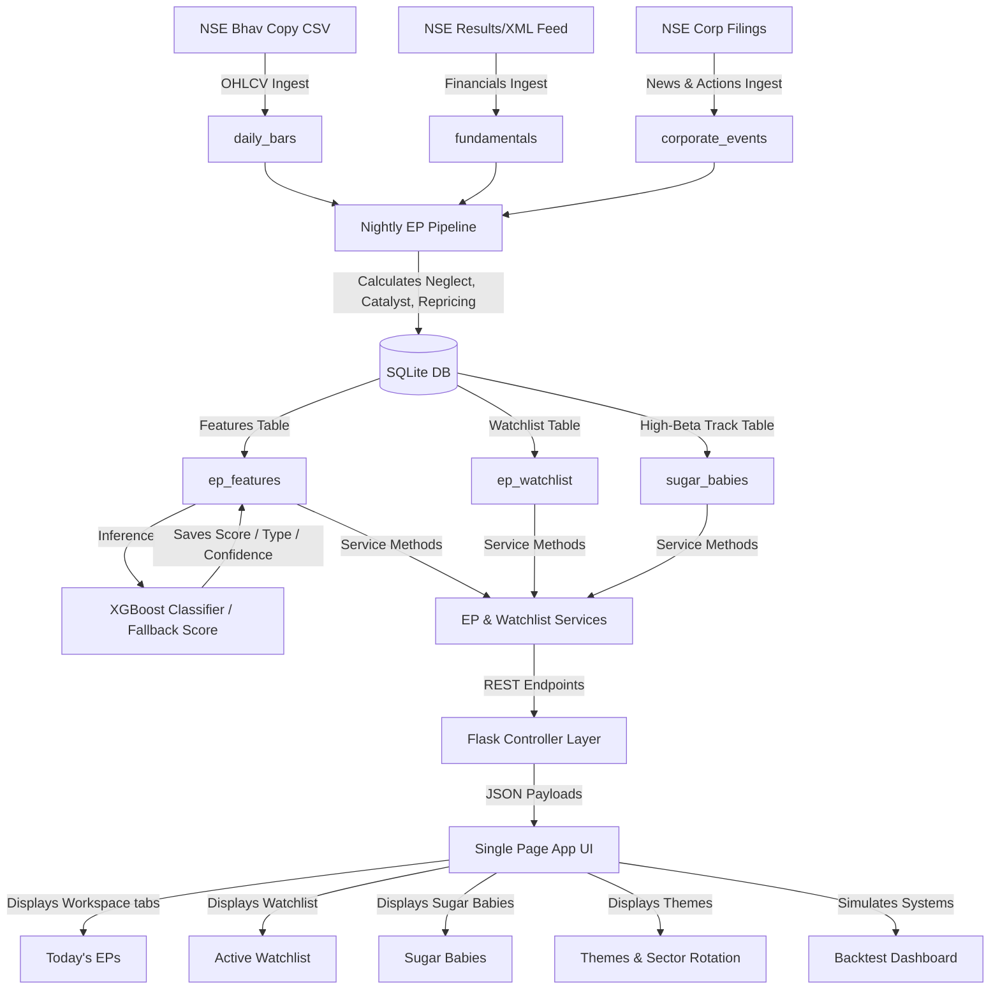

# Episodic Pivot (EP) Screener — System Architecture & Technical Understanding

This document provides a comprehensive technical overview and architectural blueprint of the Episodic Pivot (EP) Screener module in MomentumScan. It outlines the codebase organization, data flows, database schemas, scoring engines, API layouts, background workers, and front-end implementations.

---

## 1. System Overview

The **Episodic Pivot (EP) Screener** is a quantitative and qualitative scanning engine tailored for the Indian Equity Market (NSE/BSE). The strategy (adapted from Pradeep Bonde) aims to identify **neglected stocks** that receive a **powerful corporate catalyst** and undergo a **rapid price and volume repricing** (typically seeking 50–300% moves in 10–20 trading days).



---

## 2. Codebase Organization

The EP screener's components are modularized across the backend and frontend:

| Component | Layer | Files |
| :--- | :--- | :--- |
| **Database Models** | Data Persistence | [models.py](file:///c:/Users/91996/Documents/My%20Projects/stock-screener/app/models.py) <br> [database.py](file:///c:/Users/91996/Documents/My%20Projects/stock-screener/app/database.py) |
| **Scoring & Core Logic** | Business Logic | [ep_service.py](file:///c:/Users/91996/Documents/My%20Projects/stock-screener/app/services/ep_service.py) |
| **Watchlist Logic** | Business Logic | [watchlist_service.py](file:///c:/Users/91996/Documents/My%20Projects/stock-screener/app/services/watchlist_service.py) |
| **API Endpoints** | REST Controller | [ep.py](file:///c:/Users/91996/Documents/My%20Projects/stock-screener/app/api/v1/ep.py) <br> [ep_watchlist.py](file:///c:/Users/91996/Documents/My%20Projects/stock-screener/app/api/v1/ep_watchlist.py) |
| **Background Scheduler** | Task Runner | [scheduler.py](file:///c:/Users/91996/Documents/My%20Projects/stock-screener/app/tasks/scheduler.py) |
| **Frontend Layout** | HTML Template | [index.html](file:///c:/Users/91996/Documents/My%20Projects/stock-screener/templates/index.html) |
| **Frontend Interaction** | JS Application | [app.js](file:///c:/Users/91996/Documents/My%20Projects/stock-screener/static/js/app.js) |

---

## 3. Database Schema Definitions

The data layer uses SQLite via SQLAlchemy ORM. The core tables are defined as follows:

### 3.1 `ep_features`
Holds point-in-time calculation snapshots of EP candidates on the day of their repricing.
- **Key Columns**:
  - `symbol` (VARCHAR): Stock ticker (e.g. `NAM-INDIA`).
  - `feature_date` (DATE): The scan day.
  - `neglect_score`, `catalyst_score`, `repricing_score` (NUMERIC): Composite sub-scores (0.00 to 1.00).
  - `ep_score` (NUMERIC): Final prediction score.
  - `ep_type` (VARCHAR): Classification (`Growth EP`, `Volume EP`, `Turnaround EP`, `Story EP`, `Delayed EP`, `Short EP`).
  - `confidence` (VARCHAR): High, Medium, or Low conviction indicator.
  - `price_change_pct` (NUMERIC): Day-1 close-to-close price gain.
  - `gap_pct`, `rel_volume`, `close_loc` (NUMERIC): Component data.
  - `market_cap_cr`, `avg_turnover_cr` (NUMERIC): Liquidity parameters.
- **Indexes**:
  - `idx_ep_features_date` on `feature_date`
  - `idx_ep_features_score` on `(feature_date, ep_score)`
  - `idx_ep_features_symbol_date` on `(symbol, feature_date)`

### 3.2 `ep_watchlist`
Stores candidate tickers added to the active 20-trading-session observation window.
- **Key Columns**:
  - `symbol` (VARCHAR): Ticker symbol.
  - `catalyst_date` (DATE): Original Day-1 catalyst date.
  - `status` (VARCHAR): `ACTIVE`, `TRIGGERED`, `EXPIRED`, or `STOPPED`.
  - `days_on_watch` (INTEGER): Daily incremental counter. Aged out and set to `EXPIRED` if value exceeds 20.
  - `entry_price`, `stop_price`, `target_price` (NUMERIC): Trade setup constraints.
  - `trigger_type` (VARCHAR): Entry triggers (`RED_TO_GREEN`, `RANGE_BREAKOUT`, `RECLAIM`).
  - `notes` (TEXT): User-added trade thesis description.

### 3.3 `sugar_babies`
A curated list tracking low-float, high-beta momentum swing stocks.
- **Key Columns**:
  - `symbol` (VARCHAR): Ticker symbol.
  - `added_date` (DATE): Addition timestamp.
  - `avg_burst_pct` (NUMERIC): Average price expansion during historical runs.
  - `avg_burst_days` (NUMERIC): Average duration of previous momentum bursts.
  - `episode_count` (INTEGER): Total number of historical EPs recorded.
  - `is_active` (BOOLEAN): Inclusion toggle.

### 3.4 `corporate_events`
Stores parsed and classified corporate filings used as catalyst inputs.
- **Key Columns**:
  - `symbol` (VARCHAR): Ticker symbol.
  - `event_date` (DATE): Event publication date.
  - `event_type` (VARCHAR): `BLOWOUT_EARNINGS`, `ORDER_WIN`, `MGMT_CHANGE`, `CAPEX_EXPANSION`, `THEME_CATALYST`, etc.
  - `sentiment` (SMALLINT): Sentiment polarity (-1, 0, or 1).
  - `nlp_sentiment_score` (NUMERIC): Continuous NLP score from LLM/NLP pipelines.
  - `summary` (TEXT): Summarized brief of the news.

---

## 4. Ingestion & Nightly Pipeline

The scan runs daily after market hours (typically 5:00 PM IST) and performs:
1. **OHLCV Ingest**: Fetches daily price-volume data from the NSE Bhav Copy and updates `daily_bars`.
2. **Event & Financial Ingest**: Downloads corporate filings, updates quarterly earnings records (`fundamentals`), and processes announcements via NLP pipelines (`corporate_events`).
3. **Scoring Engine**: Scans tickers with relative volume $\ge 3\text{x}$ or active news and writes features into `ep_features`.
4. **Watchlist Maintenance**: Updates active watchlists, checks delayed setup triggers, increments `days_on_watch`, and auto-expires old candidates.

---

## 5. Scoring Mechanics & Formulas

The core business logic resides in [ep_service.py](file:///c:/Users/91996/Documents/My%20Projects/stock-screener/app/services/ep_service.py). It normalizes component metrics between 0 and 1, calculates sub-scores, and generates the final EP rating.

### 5.1 Sub-Score Formulations

```
  Metric Normalization Definitions:
  - performance_3m/6m  : Decline is normalized as neglect. Drops below -40% approach 1.0.
  - consolidation_range : (Max - Min) / Close over 60 days. Tighter ranges approach 1.0.
  - avg_volume_percentile: Low volume ranking compared to sector peers approaches 1.0.
```

#### Neglect Score (Weight: 25% in Fallback)
Measures how quiet and range-bound the stock has been prior to Day 1:
$$\text{Neglect} = \text{Weighted Sum of normalized } [\text{Perf 3M}, \text{Perf 6M}, \text{60D range}, \text{Volume Rank}]$$

#### Catalyst Score (Weight: 35% in Fallback)
Looks up the base score by announcement category, applying size and expansion bonuses:
$$\text{Base Score} = \text{Lookup}(\text{Event Type}) \quad [\text{e.g. BLOWOUT EARNINGS} \rightarrow 0.90]$$
$$\text{Bonuses} = +0.10 \text{ (Rev Growth } \ge 100\%) \ + 0.10 \text{ (Profit Growth } \ge 200\%) \ + 0.05 \text{ (Mkt Cap } < 5000\text{ Cr)}$$
$$\text{Catalyst Score} = \min(1.0, \text{Base} + \text{Bonuses})$$

> [!NOTE]
> Short EP catalysts (e.g. guidance cuts, accounting issues) return negative base values (e.g. $-0.80$ to $-0.90$), allowing negative classification and Short EP trade separation.

#### Repricing Score (Weight: 30% in Fallback)
Quantifies Day-1 breakout strength:
$$\text{Repricing} = 0.30 \cdot (\text{Gap \%} / 20) + 0.35 \cdot ((\text{RVOL} - 1) / 9) + 0.20 \cdot \text{Close Loc} + 0.15 \cdot \text{Price Change Strength}$$

---

### 5.2 EP Score Prediction & Fallback

The system loads a machine learning model to evaluate the probability of a fast momentum continuation, falling back to a weighted sum on failure.

```
                  ┌───────────────────────────────┐
                  │ predict_ep_score(features)   │
                  └──────────────┬────────────────┘
                                 │
                      [Attempt ML Prediction]
                                 │
                   Does model load successfully?
                    /                       \
                  YES                        NO
                  /                            \
   ┌─────────────────────────────┐   ┌──────────────────────────────┐
   │ Predict using XGBoost       │   │ Calculate weighted fallback: │
   │ classifier probability:     │   │ ep_score = 0.25 * neglect + │
   │ - Load: ep_scoring_model    │   │            0.35 * |cat| +    │
   │ - Map inputs via Manifest   │   │            0.30 * repricing +│
   │ - Output probability (0-1)  │   │            0.10 * has_fund   │
   └─────────────────────────────┘   └──────────────────────────────┘
```

#### ML Scoring Pipeline
1. **Lazy Loading**: The helper `_load_ep_model` reads the model path dynamically via `current_app.config['EP_MODEL_PATH']` (standard default is `models/ep_scoring_model_latest.pkl`).
2. **Manifest Mapping**: The model checks the companion JSON file `ep_scoring_model_latest_manifest.json` to extract `feature_order`. Features are ordered precisely (e.g. `neglect_score`, `catalyst_score`, `repricing_score`, `liquidity_ok`, `has_fundamentals`, one-hot events).
3. **Inference**: Returns positive-class classification probability (0.0 to 1.0).

#### Hand-crafted Fallback Scoring
Used on inference fail or missing pickle file:
$$\text{Raw Score} = 0.25 \cdot \text{Neglect} + 0.35 \cdot |\text{Catalyst}| + 0.30 \cdot \text{Repricing} + 0.10 \cdot (1.0 \text{ if has\_fundamentals else } 0.0)$$
$$\text{EP Score} = \max(0.0, \min(1.0, \text{Raw Score} + \text{Liquidity Adjustment}))$$

---

### 5.3 Conviction & Classifications

#### Confidence Tiers
Scores are mapped to conviction bins:
- **HIGH**: $\text{EP Score} \ge 0.72 \quad \text{AND} \quad \text{Catalyst Score} \ge 0.70 \quad \text{AND} \quad \text{Repricing Score} \ge 0.60$
- **MEDIUM**: $\text{EP Score} \ge 0.55$
- **LOW**: $\text{EP Score} < 0.55$

#### EP Type Classification
Categorized using `assign_ep_type`:
- `Short EP`: Catalyst score is negative or flag `is_negative_catalyst` is set.
- `Volume EP`: Event type is `ABNORMAL_VOLUME` or `UNKNOWN`.
- `Delayed EP`: Day-1 breakout is messy or experiences a delayed consolidation.
- `Growth EP`: Catalyst is earnings-based and Sales YoY growth $\ge 100\%$.
- `Turnaround EP`: Catalyst is earnings-based and surprise type is `TURNAROUND`.
- `Story EP`: Catalyst is policy, capex, PLI tailwinds, or order wins.

---

## 6. REST API Endpoints

The API is exposed via blueprints registered under `/api/v1` in [ep.py](file:///c:/Users/91996/Documents/My%20Projects/stock-screener/app/api/v1/ep.py) and [ep_watchlist.py](file:///c:/Users/91996/Documents/My%20Projects/stock-screener/app/api/v1/ep_watchlist.py):

| Method | Endpoint | Description | Query/Body Params |
| :--- | :--- | :--- | :--- |
| `GET` | `/api/ep/today` | Fetches current EP signals. | `ep_type`, `confidence`, `min_score`, `min_mktcap`, `max_mktcap`, `exchange`, `limit`, `offset` |
| `GET` | `/api/ep/<symbol>/detail` | Retrieves deep-dive stats. | *None* |
| `GET` | `/api/ep/watchlist` | Fetches active watchlist items (with dynamic CMP and gain % calculation). | *None* |
| `POST` | `/api/ep/watchlist` | Adds/updates watchlist items. | `symbol`, `exchange`, `stop_price`, `notes` |
| `POST` | `/api/ep/watchlist/remove` | Removes item from active watchlist. | `symbol` (or `symbols` list for bulk deletion) |
| `POST` | `/api/ep/watchlist/trigger` | Manually triggers active item. | `symbol` |
| `GET` | `/api/ep/sugar-babies` | Fetches active high-risk setups. | *None* |
| `POST` | `/api/ep/sugar-babies` | Adds/removes a Sugar Baby. | `symbol`, `exchange`, `notes`, `is_active` |
| `GET` | `/api/ep/themes` | Groups EPs into thematic clusters. | `types` (all, Growth, Turnaround, Story, Volume) |
| `GET` | `/api/ep/sector-rotation` | Overlays EP data on sector strength. | *None* |
| `POST` | `/api/ep/refresh` | Triggers manual background scans. | *None* |
| `GET` | `/api/ep/refresh/status` | Queries scan execution status. | *None* |
| `POST` | `/api/ep/backtest/prepare` | Prepares historical backtest ranges. | `start_date`, `end_date`, `symbols` |
| `GET` | `/api/ep/backtest/prep_status` | Status of historical data preps. | *None* |
| `POST` | `/api/ep/backtest` | Simulates rules-based EP systems. | Backtest configuration JSON |

---

## 7. Frontend Integration

The user interface is a tabbed workspace in [index.html](file:///c:/Users/91996/Documents/My%20Projects/stock-screener/templates/index.html) controlled by [app.js](file:///c:/Users/91996/Documents/My%20Projects/stock-screener/static/js/app.js).

### 7.1 Tabs and Controllers
- **Today's EPs**: Standard filterable list displaying scans, relative volumes, gap sizes, and calculated scores.
- **Active Watchlist**: Lists items under active observation with dynamic CMP and color-coded Gain % columns. Supports bulk-removal and CSV exports (with CMP and Gain % included).
- **Sugar Babies**: Displays high-risk breakouts accompanied by a warning banner and average burst metrics.
- **Themes & Rotation**: Clustered sectors and rotation quadrants merged with current watchlist totals.
- **Backtest Engine**: Configuration card for running simulations over custom dates.

### 7.2 Custom Select Dropdowns
Custom dropdown nodes styling is synced to hidden native selects (`#filter-ep-type` and `#filter-ep-confidence`). Dropdowns intercept click events and fire a `change` event dispatch, maintaining modular compatibility with native form layouts.

### 7.3 Detail Modal & Chart Rendering
Clicking any symbol in the workspace triggers `openEPDetailModal(symbol)`:
1. **Financial Trends**: Loops through quarterly objects. Calculates and prefixes positive/negative icons (`▲`, `▼`, `—`) dynamically next to profit/revenue columns based on YoY results.
2. **safety-oriented Events Query**: Detail triggers run safe raw SQLite queries for events, preventing SQLAlchemy date-format conversion failures on various announcement timestamps.
3. **Interactive Charts**: Clears previous nodes, mounts a TradingView Lightweight Chart, binds a `ResizeObserver`, and populates candlestick objects from `history` arrays.
4. **Stale closures Fix**: The modal recreates button nodes using `.cloneNode(true)` prior to binding click event actions. This clears older closures, ensuring operations are performed on the current symbol.

---

## 8. Background Scheduler Tasks

APScheduler runs tasks in [scheduler.py](file:///c:/Users/91996/Documents/My%20Projects/stock-screener/app/tasks/scheduler.py) inside the Flask app context:
- **`ep_refresh_job`** (30 Minutes): Triggers scans to fetch daily Bhav Copies and recalculate scores.
- **`ipo_refresh_job`** (1 Hour): Syncs new listing calendars.
- **`ep_model_training`** (Daily, 16:00 IST): Retrains the XGBoost classifier using historical data and targets (re-generating pickle artifacts and manifest files on success).
- **Watchlist Increment** (Daily): Watchlist days are updated and aged items are expired. Runs automatically inside nightly scan operations.

> [!WARNING]
> Background tasks are disabled when `TESTING = True` or when pytest runs (`PYTEST_CURRENT_TEST` env exists) to avoid sqlite lock conflicts during testing.

---

## 9. Verification & Safety

### Safe Date Parsing
SQLite date columns occasionally contain diverse string formats (e.g. `DD-Mon-YYYY` vs `YYYY-MM-DD`). The service limits queries to raw SQL `ORDER BY id` when listing events to avoid database runtime exceptions.

### Cooldowns & Concurrency
Background scans are protected by a thread lock (`ep_refresh_lock`) and a 60-second execution cooldown to prevent resource exhaustion.
