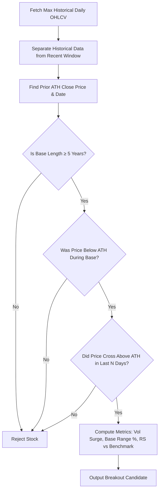

# Multiyear Breakout Scanner — Architectural Guide & Implementation Reference

A comprehensive guide explaining the mechanics, mathematical algorithms, data pipelines, and Python implementation of the **Multiyear All-Time High Breakout** screener. This document is designed for quick adaptation into **Google AI Studio**, standalone Python applications, and algorithmic trading pipelines.

---

## Table of Contents

1. [Market Theory & Trading Thesis](#1-market-theory--trading-thesis)
2. [Step-by-Step Mathematical Algorithm](#2-step-by-step-mathematical-algorithm)
3. [Key Parameters & Tuning](#3-key-parameters--tuning)
4. [Standalone Python Implementation](#4-standalone-python-implementation)
5. [Integrating with Google AI Studio & Gemini API](#5-integrating-with-google-ai-studio--gemini-api)
6. [Best Practices & Edge Cases](#6-best-practices--edge-cases)

---

## 1. Market Theory & Trading Thesis

A **Multiyear Breakout** occurs when a stock's price crosses above a major resistance level (typically its previous All-Time High) that has capped its price for **5 to 15+ years**.

### Why Multiyear Breakouts Produce Asymmetric Moves:
1. **Supply Exhaustion**: Investors who bought at the peak years ago and held through a multi-year drawdown have either sold at a loss or are happy to break even. Once that "trapped supply" is absorbed, overhead resistance disappears.
2. **Structural / Fundamental Transformation**: A company rarely breaks a 5–15 year ceiling by accident. It usually coincides with a major business model shift, industry tailwind, massive capacity expansion, or earnings inflection.
3. **No Overhead Trapped Sellers**: With price in "blue sky territory" (uncharted highs), every existing shareholder is in profit, reducing panic selling and allowing momentum to run freely.

```
 Price
   ▲
   │        Peak (ATH) ─────────────┐ (Resistance)
   │       /                         \                      Breakout!
   │      /                           \                    ▲ /
   │     /                             \                  / │
   │    /                               \   Consolidation/  │
   │   /                                 \      Base    /   │
   │  /                                   \____________/    │
   │ /                                                      │
   └────────────────────────────────────────────────────────┴────────► Time
     ◄─── Prior Run ───►◄─────── 5 to 15+ Year Base ────────► Now
```

---

## 2. Step-by-Step Mathematical Algorithm

The algorithm evaluates the full daily price history ($T$ bars) of a stock through 5 sequential filtering stages:



### Stage 1: History Segmentation
Given time-series bars $B = \{b_1, b_2, \dots, b_n\}$ where each $b_t = (\text{date}_t, \text{open}_t, \text{high}_t, \text{low}_t, \text{close}_t, \text{volume}_t)$:
- Split $B$ into two segments:
  - **Historical Base Period**: $B_{\text{hist}} = \{b_1, \dots, b_{n - W}\}$ where $W$ is the recent breakout lookback window (default: $W = 10$ trading days).
  - **Recent Window**: $B_{\text{recent}} = \{b_{n - W + 1}, \dots, b_n\}$.

### Stage 2: Historical Peak Identification
Find the maximum closing price in the historical segment:
$$\text{ATH}_{\text{prior}} = \max_{1 \le t \le n - W} (\text{close}_t)$$
Let $t_{\text{ath}}$ be the index where this peak occurred, with date $D_{\text{ath}} = \text{date}_{t_{\text{ath}}}$.

### Stage 3: Base Length Verification
Calculate the calendar years between the prior ATH date and the latest trading date:
$$\text{Years}_{\text{base}} = \frac{\text{Date}_{\text{latest}} - D_{\text{ath}}}{365.25}$$
- **Condition**: $\text{Years}_{\text{base}} \ge \text{MinBaseYears}$ (default: $5.0$ years).

### Stage 4: Base Cleanliness Check
Ensure the stock did not repeatedly breach the ATH during the consolidation period:
- Iterate through $t \in [t_{\text{ath}} + 1, n - W]$. If $\text{close}_t \ge \text{ATH}_{\text{prior}} \times (1 - \epsilon)$ (where tolerance $\epsilon = 0.01$):
  - If $\text{close}_t > \text{ATH}_{\text{prior}}$, adjust $\text{ATH}_{\text{prior}} = \text{close}_t$ and update $D_{\text{ath}} = \text{date}_t$.
  - Re-evaluate $\text{Years}_{\text{base}}$ from the updated peak date.

### Stage 5: Fresh Breakout Detection
Check if any candle in the recent window broke above the prior ATH:
$$\exists\, b_k \in B_{\text{recent}} \quad \text{such that} \quad \text{close}_k > \text{ATH}_{\text{prior}}$$
Let $k_{\text{breakout}}$ be the first index in the recent window where this condition is satisfied.

### Stage 6: Metric Calculations
1. **Percentage Above ATH**:
   $$\% \Delta_{\text{ATH}} = \frac{\text{close}_n - \text{ATH}_{\text{prior}}}{\text{ATH}_{\text{prior}}} \times 100$$
2. **Volume Confirmation**:
   $$\overline{V}_{20} = \frac{1}{20} \sum_{i=k-20}^{k-1} \text{volume}_i$$
   $$\text{VolumeConfirmed} = \begin{cases} \text{True} & \text{if } \text{volume}_{k_{\text{breakout}}} \ge \overline{V}_{20} \times 1.0 \\ \text{False} & \text{otherwise} \end{cases}$$
3. **Consolidation Base Range Width**:
   $$\text{BaseLow} = \min_{t_{\text{ath}} \le t \le n - W} (\text{low}_t)$$
   $$\text{RangeWidth}_{\%} = \frac{\text{ATH}_{\text{prior}} - \text{BaseLow}}{\text{ATH}_{\text{prior}}} \times 100$$
4. **Relative Strength (RS) vs Benchmark (e.g., Nifty 50)**:
   $$R_{\text{stock}} = \frac{\text{close}_n - \text{close}_{n-50}}{\text{close}_{n-50}}, \quad R_{\text{index}} = \frac{\text{index}_n - \text{index}_{n-50}}{\text{index}_{n-50}}$$
   $$\text{RS}_{\text{50d}} = R_{\text{stock}} - R_{\text{index}}$$

---

## 3. Key Parameters & Tuning

| Parameter | Default | Range | Description |
|---|---|---|---|
| `min_base_years` | `5` | `3` – `15` | Minimum years the stock must have consolidated below its prior ATH. |
| `breakout_window_days` | `10` | `5` – `30` | Maximum trading days since the breakout candle occurred. |
| `volume_avg_period` | `20` | `10` – `50` | Moving average period for breakout volume comparison. |
| `min_market_cap_inr` | `10,000,000,000` (₹1,000 Cr) | `≥ 0` | Filters out micro-caps and illiquid penny stocks. |
| `tolerance` | `0.01` (1%) | `0.0` – `0.03` | Threshold buffer to prevent false resets from intraday wicks. |

---

## 4. Standalone Python Implementation

This script is self-contained and runs with `yfinance` and `pandas`.

```python
"""
Multiyear All-Time High Breakout Scanner
Author: Antigravity AI
"""

import yfinance as yf
import pandas as pd
import numpy as np
from datetime import datetime, timedelta
from concurrent.futures import ThreadPoolExecutor, as_completed
from typing import List, Dict, Any, Optional


def fetch_symbol_history(symbol: str) -> Optional[List[Dict[str, Any]]]:
    """Fetch maximum available daily history from Yahoo Finance."""
    ticker_str = symbol if symbol.endswith((".NS", ".BO", "^NSEI")) else f"{symbol}.NS"
    try:
        ticker = yf.Ticker(ticker_str)
        df = ticker.history(period="max", auto_adjust=True)
        if df is None or df.empty or len(df) < 252 * 3:
            return None

        rows = []
        for idx, row in df.iterrows():
            close_val = float(row.get("Close", 0))
            if close_val <= 0:
                continue
            rows.append({
                "date": idx.strftime("%Y-%m-%d"),
                "open": float(row.get("Open", 0)),
                "high": float(row.get("High", 0)),
                "low": float(row.get("Low", 0)),
                "close": close_val,
                "volume": int(row.get("Volume", 0)),
            })
        return rows if len(rows) > 0 else None
    except Exception as e:
        return None


def evaluate_multiyear_breakout(
    symbol: str,
    history: List[Dict[str, Any]],
    nifty_history: Optional[List[Dict[str, Any]]] = None,
    min_base_years: int = 5,
    breakout_window_days: int = 10,
) -> Optional[Dict[str, Any]]:
    """Scan a single stock's history for a multiyear ATH breakout."""
    if not history or len(history) < 252 * min_base_years:
        return None

    closes = [b["close"] for b in history]
    dates = [b["date"] for b in history]
    volumes = [b["volume"] for b in history]
    n = len(closes)

    cutoff = max(0, n - breakout_window_days)
    if cutoff < 252:
        return None

    # Find prior All-Time High before the recent window
    prior_closes = closes[:cutoff]
    prior_ath = max(prior_closes)
    prior_ath_idx = prior_closes.index(prior_ath)
    prior_ath_date = dates[prior_ath_idx]

    try:
        ath_dt = datetime.strptime(prior_ath_date, "%Y-%m-%d")
        latest_dt = datetime.strptime(dates[-1], "%Y-%m-%d")
    except Exception:
        return None

    years_since_ath = (latest_dt - ath_dt).days / 365.25
    if years_since_ath < min_base_years:
        return None

    # Base cleanliness: adjust if there was an intermediate high
    tolerance = prior_ath * 0.01
    for i in range(prior_ath_idx + 1, cutoff):
        if closes[i] > prior_ath:
            prior_ath = closes[i]
            prior_ath_idx = i
            prior_ath_date = dates[i]

    # Re-verify years since adjusted peak
    try:
        ath_dt = datetime.strptime(prior_ath_date, "%Y-%m-%d")
        years_since_ath = (latest_dt - ath_dt).days / 365.25
    except Exception:
        return None

    if years_since_ath < min_base_years:
        return None

    # Check for breakout in recent window
    recent_closes = closes[cutoff:]
    breakout_occurred = False
    breakout_idx = None
    for i, c in enumerate(recent_closes):
        if c > prior_ath:
            breakout_occurred = True
            breakout_idx = cutoff + i
            break

    if not breakout_occurred or breakout_idx is None:
        return None

    current_price = closes[-1]
    pct_above_ath = round(((current_price - prior_ath) / prior_ath) * 100, 2)

    # Volume confirmation
    vol_start = max(0, breakout_idx - 20)
    avg_vol = np.mean(volumes[vol_start:breakout_idx]) if breakout_idx > vol_start else 0
    breakout_vol = volumes[breakout_idx]
    vol_confirmed = bool(avg_vol > 0 and breakout_vol > avg_vol)

    # Base consolidation range
    base_closes = closes[prior_ath_idx:cutoff]
    base_low = min(base_closes) if base_closes else prior_ath
    consolidation_range = round(((prior_ath - base_low) / prior_ath) * 100, 2)

    # Relative Strength vs Nifty 50
    rs_vs_nifty = None
    if nifty_history and len(nifty_history) >= 50:
        nifty_closes = [b["close"] for b in nifty_history]
        nifty_50d = (nifty_closes[-1] - nifty_closes[-50]) / nifty_closes[-50]
        stock_50d = (closes[-1] - closes[-50]) / closes[-50] if len(closes) >= 50 else 0
        rs_vs_nifty = round(stock_50d - nifty_50d, 4)

    return {
        "symbol": symbol,
        "current_price": round(current_price, 2),
        "prior_ath_price": round(prior_ath, 2),
        "prior_ath_date": prior_ath_date,
        "breakout_date": dates[breakout_idx],
        "years_below_ath": round(years_since_ath, 1),
        "pct_above_ath": pct_above_ath,
        "volume_confirmed": vol_confirmed,
        "breakout_volume": breakout_vol,
        "avg_volume_20d": int(avg_vol),
        "consolidation_range_pct": consolidation_range,
        "base_low": round(base_low, 2),
        "rs_vs_nifty": rs_vs_nifty,
    }


def scan_universe(symbols: List[str], min_base_years: int = 5, breakout_window_days: int = 10):
    """Run parallel scanner across a universe of symbols."""
    print(f"Scanning {len(symbols)} symbols for {min_base_years}+ year ATH breakouts...")
    nifty_history = fetch_symbol_history("^NSEI")

    results = []
    with ThreadPoolExecutor(max_workers=12) as executor:
        futures = {executor.submit(fetch_symbol_history, sym): sym for sym in symbols}
        for future in as_completed(futures):
            sym = futures[future]
            try:
                hist = future.result()
                if hist:
                    cand = evaluate_multiyear_breakout(
                        sym, hist, nifty_history, min_base_years, breakout_window_days
                    )
                    if cand:
                        results.append(cand)
            except Exception as e:
                pass

    results.sort(key=lambda r: r["years_below_ath"], reverse=True)
    return results


if __name__ == "__main__":
    # Test with a sample list of NSE tickers
    sample_symbols = [
        "RELIANCE", "TCS", "HDFCBANK", "INFY", "ITC", "INDSWFTLAB",
        "TATACHEM", "BEL", "HAL", "BHEL", "DLF", "L&T"
    ]
    breakouts = scan_universe(sample_symbols, min_base_years=5, breakout_window_days=10)
    print(f"\nFound {len(breakouts)} breakouts:")
    for b in breakouts:
        print(f"• {b['symbol']}: ₹{b['current_price']} (Broke {b['years_below_ath']}yr ATH from {b['prior_ath_date']})")
```

---

## 5. Integrating with Google AI Studio & Gemini API

You can feed the scanner's structured output directly into **Gemini 2.0 Flash / Pro** or **Google AI Studio** to generate quantitative research notes, trade risk management plans, and fundamental validation summaries.

### Step 1: Install Google GenAI SDK
```bash
pip install google-genai
```

### Step 2: Gemini Prompt Pipeline Script

```python
import os
from google import genai
from google.genai import types

# Initialize Gemini Client (reads GEMINI_API_KEY from environment)
client = genai.Client(api_key=os.environ.get("GEMINI_API_KEY"))

def analyze_breakout_with_gemini(breakout_data: dict) -> str:
    """
    Synthesize deep quantitative trade thesis and risk management parameters
    for a multiyear breakout using Gemini 2.0.
    """
    prompt = f"""
    You are an elite quantitative equity strategist and technical analyst specializing in Indian markets (NSE).
    
    A stock has just triggered a **Multiyear All-Time High Breakout** signal:
    
    ---
    Stock Symbol: {breakout_data['symbol']}
    Current Market Price: ₹{breakout_data['current_price']}
    Prior All-Time High: ₹{breakout_data['prior_ath_price']} (Set on: {breakout_data['prior_ath_date']})
    Base Length: {breakout_data['years_below_ath']} Years
    Breakout Date: {breakout_data['breakout_date']}
    % Above Prior ATH: {breakout_data['pct_above_ath']}%
    Volume Confirmed: {breakout_data['volume_confirmed']} (Volume: {breakout_data['breakout_volume']:,} vs 20D Avg: {breakout_data['avg_volume_20d']:,})
    Consolidation Base Range: {breakout_data['consolidation_range_pct']}% (Base Low: ₹{breakout_data['base_low']})
    Relative Strength vs Nifty 50: {breakout_data.get('rs_vs_nifty', 'N/A')}
    ---

    Provide a structured technical & momentum breakdown:
    1. **Structural Setup**: Analyze the significance of the {breakout_data['years_below_ath']}-year base and what supply absorption implies.
    2. **Volume Quality**: Evaluate the volume surge characteristics.
    3. **Key Levels & Trade Plan**:
       - Recommended Entry Zone
       - Invalidation / Stop Loss Level (e.g., prior resistance retest)
       - Measured Move Target (based on base depth)
       - Risk-to-Reward Ratio
    4. **Key Failure Modes**: What false-breakout risks should traders watch out for?
    """

    response = client.models.generate_content(
        model="gemini-2.0-flash",
        contents=prompt,
        config=types.GenerateContentConfig(
            temperature=0.2,
            max_output_tokens=1000,
        ),
    )

    return response.text
```

### Step 3: Google AI Studio System Instructions

If using the **Google AI Studio Web UI** (https://aistudio.google.com):

1. **Model**: Select `Gemini 2.0 Flash` or `Gemini 1.5 Pro`.
2. **System Instructions**:
   ```text
   You are an institutional quantitative trading assistant. Analyze multi-decade stock breakout patterns on the National Stock Exchange of India (NSE). Emphasize risk-defined trade plans, base depth measured move targets, and false-breakout invalidation levels.
   ```
3. **Structured Output (JSON Schema)**:
   Toggle `Structured Output` and use:
   ```json
   {
     "type": "OBJECT",
     "properties": {
       "symbol": {"type": "STRING"},
       "thesis": {"type": "STRING"},
       "entry_zone": {"type": "STRING"},
       "stop_loss": {"type": "NUMBER"},
       "target_1": {"type": "NUMBER"},
       "target_2": {"type": "NUMBER"},
       "risk_reward_ratio": {"type": "STRING"},
       "conviction": {"type": "STRING", "enum": ["HIGH", "MEDIUM", "SPECULATIVE"]}
     },
     "required": ["symbol", "thesis", "entry_zone", "stop_loss", "target_1", "conviction"]
   }
   ```

---

## 6. Best Practices & Edge Cases

1. **Adjusted vs Unadjusted Prices**:
   - Always use **split/bonus adjusted prices** (`auto_adjust=True` in yfinance). Failing to adjust will trigger false all-time high signals on stocks that had corporate stock splits.
2. **Handling Upper Circuits (5%/10%/20%)**:
   - In small/mid-caps, multiyear breakouts often hit upper circuits on breakout day. Volume may appear lower because sellers refuse to sell. Check if `high == close` and `open == close` for circuit-locked volume anomalies.
3. **Weekly vs Daily Confirmation**:
   - For ultra-long bases (10+ years), confirming the breakout on a **weekly closing basis** (Friday close) significantly reduces false breakout rates (whipsaws).
4. **Volume Thresholds**:
   - A valid institutional breakout should ideally have at least **1.5x to 3x** the 20-day average volume on the breakout session.
