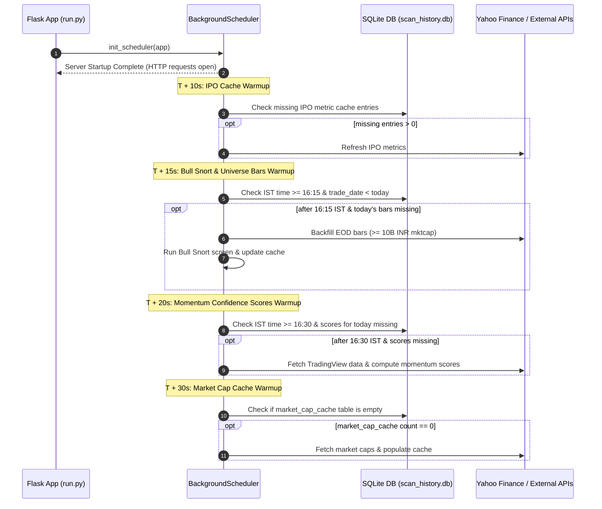

# Smart Server-Start Refresh Specification

> **Module**: `app/tasks/scheduler.py`  
> **Documentation File**: [`docs/features/smart-server-start-refresh.md`](file:///c:/Users/91996/Documents/My%20Projects/stock-screener/docs/features/smart-server-start-refresh.md)  
> **Status**: Production Ready  
> **Last Updated**: 2026-07-27  

---

## 1. Executive Summary

**Smart Server-Start Refresh** is an intelligent background synchronization mechanism built into MomentumScan's APScheduler framework. 

When the local Flask development or production server starts up, it automatically evaluates the current market state (India Standard Time — IST) and checks whether scheduled market-close tasks (e.g., 16:15 IST universe price updates, 16:30 IST momentum scores, 16:35 IST Bull Snort screening) were missed because the server was turned off during market close hours. 

If any session data for the current trading date is missing or stale, the scheduler triggers non-blocking background warm-up jobs to catch up on all missing data without slowing down page loads or blocking HTTP server initialization.

---

## 2. Problem Statement

Prior to this feature:
1. **Missed Cron Schedules**: If the user's computer or local Flask server was turned off at **16:15–16:35 IST** (after NSE market close), the scheduled cron jobs did not fire.
2. **Data Staleness Cascade**: Because `daily_bars` was only updated for high-volume EP candidate stocks during 30-minute interval refreshes, wider market cap universe stocks remained stuck on old trade dates (e.g., 17-day gap).
3. **Zero-Result Filters**: Downstream screeners like **Bull Snort** failed their internal staleness pre-filters and returned 0 candidates.

---

## 3. Architecture & Startup Timeline

When `run.py` initializes the Flask app, `init_scheduler(app)` registers cron/interval jobs along with a non-blocking sequence of **one-shot date-triggered warm-up tasks**.



---

## 4. Managed Background Jobs Matrix

| Job ID | Function | Scheduled Time (IST) | Smart Startup Logic | Trigger Condition |
|---|---|---|---|---|
| `daily_bars_universe_refresh` | `refresh_daily_bars_universe` | 16:15 IST (Daily) | Smart Startup (T+15s) | Fires if `IST >= 16:15` on a weekday and `MAX(trade_date)` in `daily_bars` < today's date. |
| `bull_snort_refresh_eod` | `refresh_bull_snort` | 16:35 IST (Daily) | Smart Startup (T+15s) | Fires immediately after universe bars refresh if `bull_snort_cache` date < today's date. |
| `daily_momentum_score_job` | `calculate_all_scores` | 16:30 IST (Daily) | Smart Startup (T+20s) | Fires if `IST >= 16:30` on a weekday and `momentum_scores` table has 0 rows for today. |
| `startup_market_cap_warmup` | `startup_market_cap_warmup` | 03:00 IST (Daily) | Smart Startup (T+30s) | Fires if `market_cap_cache` table is completely empty (0 rows). |
| `startup_ipo_warmup` | `startup_ipo_cache_warmup` | Every 1 hour | Smart Startup (T+10s) | Fires if any listings in `ipo_listings` are missing from `ipo_metrics_cache`. |
| `stage_analysis_interval` | `_run_stage_analysis_job` | Every 60 min & 16:30 IST | Startup Immediate (`next_run_time=now()`) | Recalculates 21d/50d SMAs and Weinstein stage classifications immediately upon startup. |
| `ep_refresh_job` | `refresh_ep_task` | Every 30 min | Startup + 5 min (`start_date=now()+5m`) | Scans TradingView relative volume candidates (rel_vol >= 3.0). |
| `mi_ingest_job` | `ingest_market_intelligence_task` | Every 60 min | Interval | Ingests news and filings for priority watchlist tickers. |

---

## 5. Timezone & Market Hours Rules

All time checks use **India Standard Time (IST — UTC+5:30)** using standard Python timezone offsets:

```python
from datetime import datetime, timezone, timedelta

ist = timezone(timedelta(hours=5, minutes=30))
now_ist = datetime.now(ist)
today_str = now_ist.strftime("%Y-%m-%d")

is_after_bar_close = (now_ist.hour > 16) or (now_ist.hour == 16 and now_ist.minute >= 15)
is_after_score_close = (now_ist.hour > 16) or (now_ist.hour == 16 and now_ist.minute >= 30)
is_weekday = now_ist.weekday() < 5  # Monday = 0, Friday = 4
```

### Edge Case Handling
- **Weekend Startup (Saturday / Sunday)**: `is_weekday` evaluates to `False`. If cache/bars for Friday exist, no unnecessary network requests are made.
- **Mid-Day Startup (e.g., 10:00 AM IST)**: `is_after_close` evaluates to `False`. The scheduler reuses existing cache and waits for the official 16:15 IST market close window.
- **Late Night / Next Day Startup (e.g., 8:00 PM IST or 7:00 AM next day)**: Auto-detects that market closed without data sync and catches up immediately.

---

## 6. Key Code Modifications

### `app/tasks/scheduler.py`
- Added `refresh_daily_bars_universe(app)` to sync EOD price bars for all stocks (market cap ≥ ₹1,000 Cr).
- Added `startup_bull_snort_warmup(app)` with smart IST time + date comparisons.
- Added `startup_momentum_score_warmup(app)` to catch up on missed daily momentum confidence score calculations.
- Added `startup_market_cap_warmup(app)` to seed empty market cap caches.

### `app/api/v1/legacy_routes.py`
- Updated `run_historical_backfill(symbols, start_date, end_date)` signature:
  ```python
  def run_historical_backfill(symbols=None, start_date="2019-01-01", end_date=None):
      if end_date is None:
          end_date = datetime.now().strftime("%Y-%m-%d")
  ```

### `scripts/run_universe_backfill.py`
- Added CLI support for `--mktcap-filter` to manually execute full universe backfills up to today:
  ```bash
  python scripts/run_universe_backfill.py --mktcap-filter
  ```

---

## 7. Manual CLI Commands & Testing

To test or manually trigger all background jobs with smart skipping:

```python
from app import create_app
from app.tasks.scheduler import (
    refresh_ep_task,
    startup_ipo_cache_warmup,
    startup_bull_snort_warmup,
    startup_momentum_score_warmup,
    startup_market_cap_warmup,
    ingest_market_intelligence_task
)
from app.services.stage_analyzer.scheduler import _run_stage_analysis_job

app = create_app()
with app.app_context():
    refresh_ep_task(app)
    startup_ipo_cache_warmup(app)
    startup_bull_snort_warmup(app)       # Smart skips if up-to-date
    startup_momentum_score_warmup(app)  # Smart skips if up-to-date
    _run_stage_analysis_job(app)
    startup_market_cap_warmup(app)       # Smart skips if populated
    ingest_market_intelligence_task(app)
```
